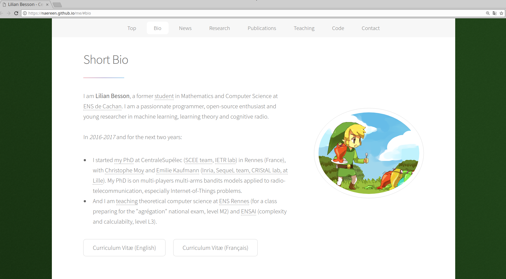
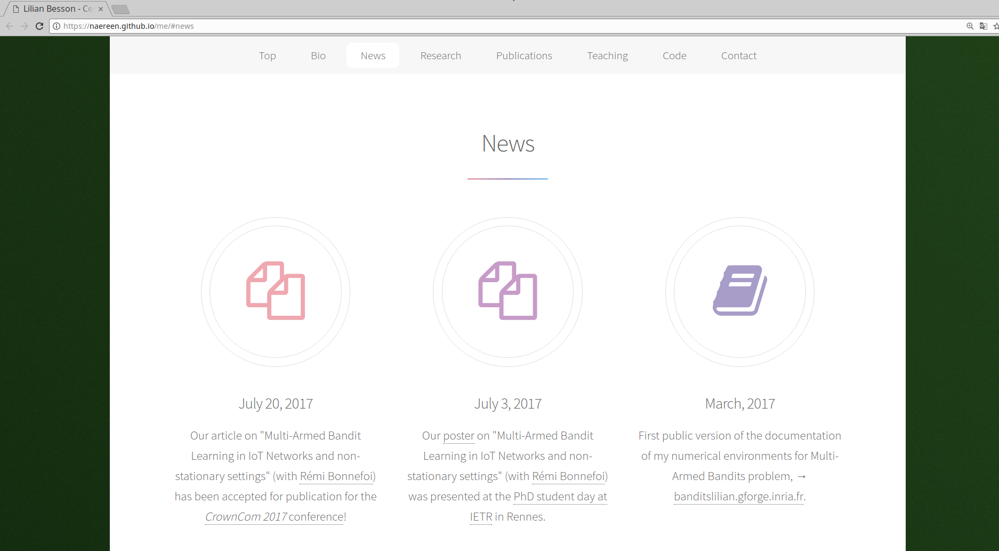
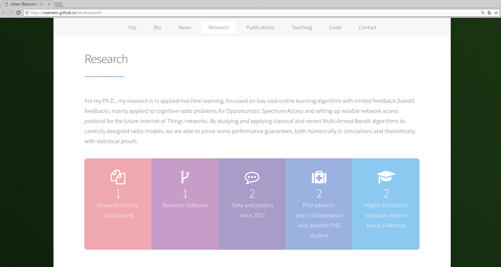
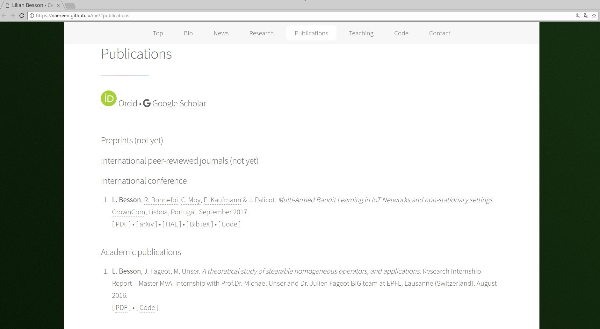
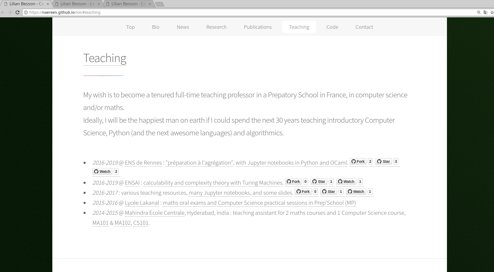
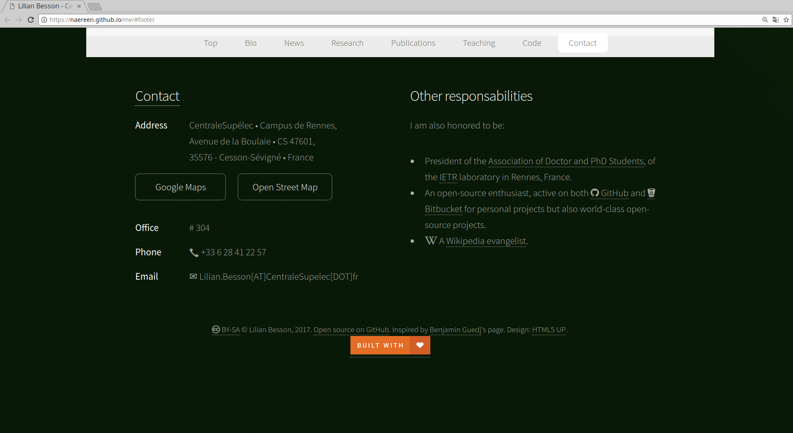

# « me.git » → [https://naereen.github.io/me/](https://naereen.github.io/me/)

> Author: [Lilian Besson (@Naereen)](https://github.com/Naereen/), inspired by [Benjamin Guedj](https://bguedj.github.io/).
> Professional website about my research activities.

## Theme:
[Stellar by HTML5 UP (html5up.net | @ajlkn)](https://html5up.net/stellar).
Free for personal and commercial use under the [CCA 3.0 license](https://creativecommons.org/licenses/by/3.0/) ([html5up.net/license](https://html5up.net/license)).

## Credits:
Icons: [Font Awesome](fortawesome.github.com/Font-Awesome)

Others:
- [jQuery](http://jquery.com)
- [CSS3 Pie](http://css3pie.com)
- [Respond.js](http://j.mp/respondjs)
- Scrollex/Scrolley (@ajlkn)
- [Skel](http://skel.io)
- html5shiv.js (@afarkas @jdalton @jon_neal @rem)

## More screenshots

## :scroll: License ? 
[CCA 3.0 licensed](https://creativecommons.org/licenses/by/3.0/) (file [LICENSE.txt](LICENSE.txt)).
© [Lilian Besson](https://GitHub.com/Naereen), 2017.

